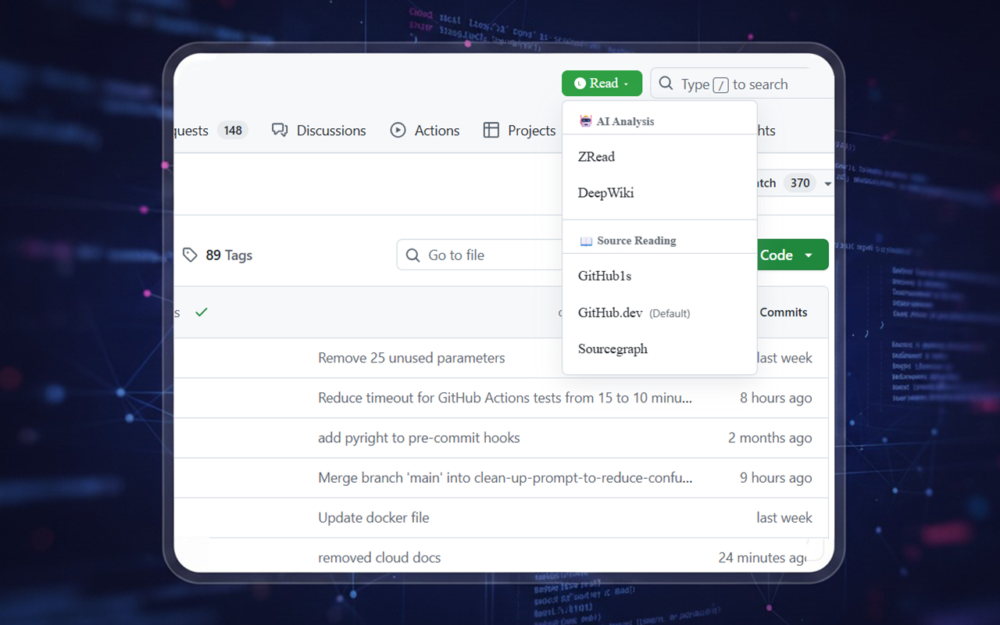
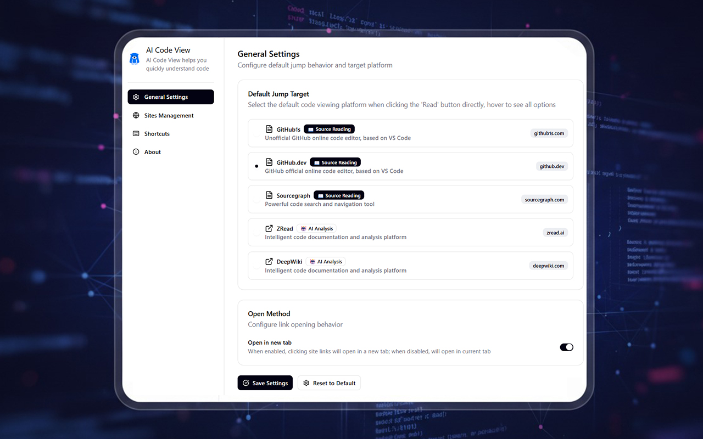
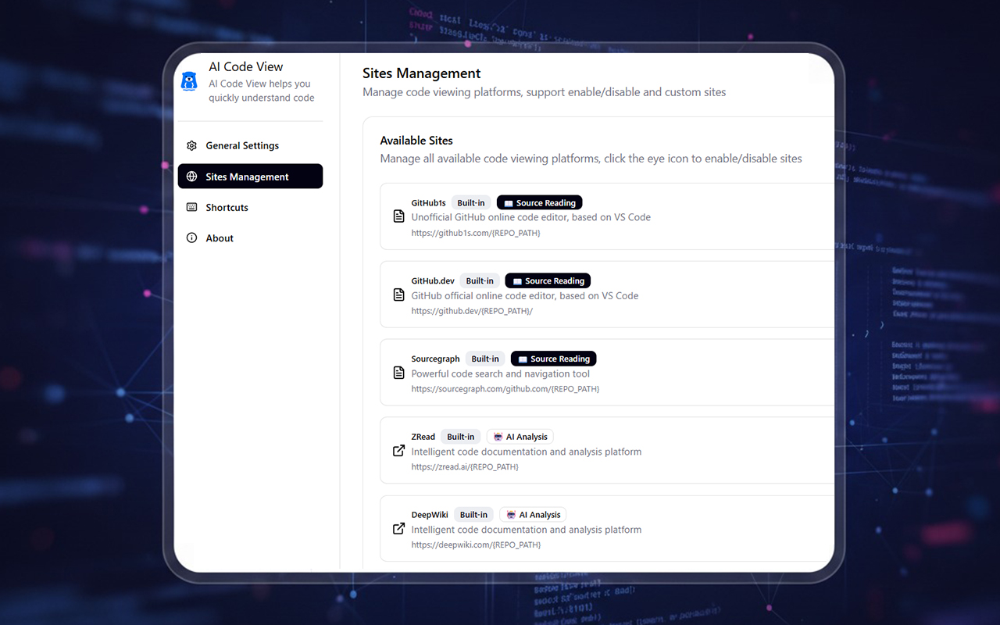
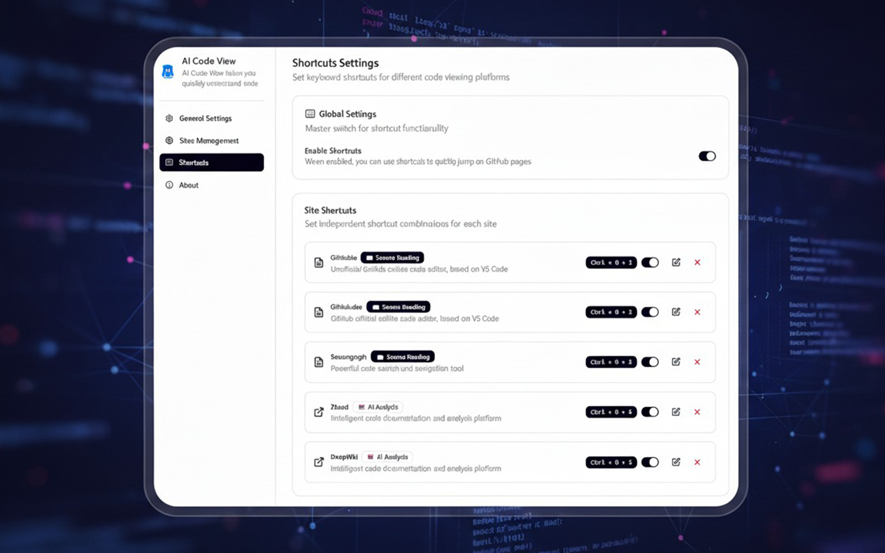

# 🚀 AI Code View「爱码视」

> 程序员的代码阅读利器，一键切换多种代码查看平台，让代码理解更高效！

## ✨ 核心特性

### 🎯 智能跳转
- 在 GitHub 仓库页面自动添加「阅读」按钮
- 支持多种代码查看平台：GitHub1s、GitHub.dev、Sourcegraph、Zread、DeepWiki
- 一键跳转，提升代码阅读效率

### ⚡ 快捷键支持
- 为每个平台设置独立的快捷键
- 支持全局快捷键开关
- 智能冲突检测，避免快捷键重复

### 🔧 灵活配置
- 自定义默认跳转目标
- 站点启用/禁用管理
- 支持自定义站点添加
- 灵活的打开方式设置

### 🎨 用户友好
- 简洁直观的界面设计
- 悬停显示所有可用选项
- 实时配置预览和保存

## 📸 功能展示

### 基本设置

配置默认跳转目标和打开方式，让代码阅读更符合你的使用习惯。

### 站点管理

管理所有代码查看平台，支持启用/禁用内置站点，未来将支持自定义站点添加。

### 快捷键配置

为每个代码查看平台设置独立的快捷键，支持快速跳转。

## 🛠️ 支持的平台

### 📖 源码阅读工具
- **GitHub1s** - 非官方 GitHub 在线代码编辑器，基于 VS Code
- **GitHub.dev** - GitHub 官方在线代码编辑器，基于 VS Code
- **Sourcegraph** - 强大的代码搜索和导航工具

### 🤖 AI 分析工具
- **Zread** - 智能代码文档和分析平台
- **DeepWiki** - 智能代码文档和分析平台

## 📦 扩展安装

### 主流浏览器支持
- **Chrome**: [Chrome Web Store](https://chrome.google.com/webstore/detail/diemcoeopjkfebcjlppfabjncmjefelm)
- **Edge**: [Microsoft Edge Addons](https://microsoftedge.microsoft.com/addons/detail/kchlpiplbhflmfclcjgkdkcbnplmlojl)

### 安装步骤
1. 点击对应浏览器的安装链接
2. 添加扩展到浏览器
3. 访问任意 GitHub 仓库页面
4. 点击「阅读」按钮开始使用

## 🔧 使用指南

### 基本使用
1. 访问 GitHub 仓库页面
2. 点击文件列表上方的「阅读」按钮
3. 选择要跳转的代码查看平台
4. 开始高效的代码阅读体验

### 快捷键使用
1. 打开扩展设置页面
2. 进入「快捷键」标签页
3. 为需要的平台设置快捷键
4. 在 GitHub 页面按下快捷键快速跳转

### 配置管理
- **基本设置**: 配置默认跳转目标和打开方式
- **站点管理**: 管理可用平台和自定义站点
- **快捷键**: 设置和调整快捷键组合

## 🎯 适用场景

- **代码审查**: 快速在不同平台间切换，获得多角度代码视图
- **开源项目研究**: 利用不同工具的优势深入理解项目结构
- **学习新项目**: 通过 AI 分析工具快速掌握代码逻辑
- **日常开发**: 提升代码浏览和理解的效率

---

**让代码阅读成为一种享受！** 🎉
